# Relearning-Content Skill Architecture

> **Version:** 3.0 (Two-Step Audio Pipeline)  
> **Last Updated:** Restored `create-script` for LLM-powered condensation + paralinguistic tags

## Overview

The `relearning-content` skill creates journal entries and project pages for the relearn.ing platform. It uses a **two-step audio pipeline** for high-quality voiceovers:

1. **`create-script` skill** — LLM-powered condensation + paralinguistic tags
2. **`voiceover` skill** — TTS generation + deployment

### Why Two Steps?

| What | `--transform` flag | `create-script` skill |
|------|-------------------|----------------------|
| **Method** | Regex/rules-based | LLM intelligence |
| **Condensation** | ❌ None | ✅ ~50% reduction |
| **Paralinguistic tags** | ❌ None | ✅ `[chuckle]`, `[sigh]`, etc. |
| **Conversational rewrite** | ❌ Basic cleanup | ✅ Full rewrite for speech |
| **Result** | 10-min article → 10-min audio | 10-min article → 5-min audio |

---

## Full Workflow Diagram

```mermaid
flowchart TB
    subgraph UserInput["User Input"]
        U1[User provides content idea]
    end

    subgraph MainAgent["Main Agent (Claude)"]
        direction TB
        M1[Load relearning-content skill]
        M2[Git pull to sync repo]
        M3[Determine content type + entry number]
        M4[Write content draft]
        M5[Spawn google-search for fact-check]
        M6[Present draft to user]
        M7[User confirms content]
        M8[Save entry-XXX.md file]
    end

    subgraph FactCheck["Subagent: google-search"]
        G1[Verify cited sources]
        G2[Find opposing viewpoints]
        G3[Return research report]
    end

    subgraph CreateScript["Step 7a: create-script Skill"]
        C1["Read entry-XXX.md"]
        C2["CONDENSE ~50%
        (LLM intelligence)"]
        C3["ADD PARALINGUISTIC TAGS
        [chuckle], [sigh], [clear throat]"]
        C4["REWRITE for conversational speech"]
        C5["Save entry-XXX.txt"]
    end

    subgraph VoiceoverCommand["Step 7b: Voiceover Command"]
        V1["voiceover_script.py
        -i archive/entry-XXX.txt
        --entry entry-XXX
        --push"]
    end

    subgraph AutomatedPipeline["Automated by Script"]
        A1[Generate TTS audio from .txt]
        A2[Deploy to public/audio]
        A3[Update frontmatter with audioUrl]
        A4[Git pull → add → commit → push]
        A5[Desktop notification]
    end

    U1 --> M1 --> M2 --> M3 --> M4
    M4 -.->|spawn| FactCheck
    FactCheck --> G1 --> G2 --> G3
    G3 -.->|return| M4
    M4 --> M6 --> M7 --> M8
    M8 --> CreateScript
    CreateScript --> C1 --> C2 --> C3 --> C4 --> C5
    C5 --> VoiceoverCommand
    VoiceoverCommand --> A1 --> A2 --> A3 --> A4 --> A5

    style MainAgent fill:#2d5a27,stroke:#333
    style FactCheck fill:#5f1e3a,stroke:#333
    style CreateScript fill:#1e3a5f,stroke:#333
    style VoiceoverCommand fill:#5f4a1e,stroke:#333
    style AutomatedPipeline fill:#3a5f1e,stroke:#333
```



---

## The Audio Pipeline Detail

```
[Journal Entry: entry-XXX.md]
        │
        │  ~2,000 words (~13 min read)
        │
        ▼
┌─────────────────────────────────────┐
│     create-script skill (LLM)       │
│                                     │
│  1. CONDENSE ~50%                   │
│     - Remove redundant examples     │
│     - Cut verbose academic prose    │
│     - Preserve key insights         │
│                                     │
│  2. ADD PARALINGUISTIC TAGS         │
│     - [chuckle] at irony            │
│     - [sigh] at frustration         │
│     - [clear throat] at transitions │
│                                     │
│  3. REWRITE for speech              │
│     - Shorter sentences             │
│     - Contractions                  │
│     - Direct address ("you", "we")  │
└─────────────────────────────────────┘
        │
        │  ~1,000 words (~6.5 min listen)
        │
        ▼
[Voiceover Script: entry-XXX.txt]
        │
        ▼
┌─────────────────────────────────────┐
│     voiceover_script.py             │
│                                     │
│  • TTS generation (Chatterbox)      │
│  • Voice cloning (clone.wav)        │
│  • LUFS normalization (-19 LUFS)    │
│  • MP3 encoding (192kbps)           │
│  • Deploy to public/audio/          │
│  • Update frontmatter               │
│  • Git push                         │
│  • Desktop notification             │
└─────────────────────────────────────┘
        │
        ▼
[Audio: entry-XXX.mp3]  →  [Published to relearn.ing]
```

---

## Subagent Decision Matrix

| Scenario | Subagent? | Action |
|----------|-----------|--------|
| Need style reference | **NO** | Style guide is in SKILL.md |
| Need to verify claims/citations | **YES** | `google-search` subagent |
| Need to scan >10 files | **YES** | `explore` subagent |
| Ready for audio script | **NO** | Use `create-script` skill in main thread |
| Ready for TTS generation | **NO** | Run voiceover bash command |

**Only ONE subagent type is typically needed:** `google-search` for fact-checking.

---

## Paralinguistic Tags Reference

The `create-script` skill adds these supported Chatterbox TTS tags:

| Tag | When to Use | Example |
|-----|-------------|---------|
| `[chuckle]` | Self-deprecating humor, light irony | "I spent three weeks on that. [chuckle] Classic." |
| `[sigh]` | Frustration, resignation, relief | "[sigh] And that's when I realized I was wrong." |
| `[laugh]` | Genuine amusement, absurdity | "Thirty-five thousand decisions a day! [laugh]" |
| `[gasp]` | Surprise, sudden realization | "[gasp] That's it. That's the answer." |
| `[clear throat]` | Topic transition, emphasis | "[clear throat] Here's the thing." |
| `[sniff]` | Emotional reflection | "Looking back now... [sniff] it was obvious." |
| `[groan]` | Bad news, frustration | "[groan] Another meeting about meetings." |

**❌ NEVER USE:** `[pause]`, `[breath]`, `[emphasis]`, `[slower]` — Chatterbox ignores these.

---

## CLI Command Reference

### Step 7a: create-script Skill

This is executed via the skill system, not a bash command. The LLM:
1. Reads the journal entry
2. Condenses ~50%
3. Adds paralinguistic tags
4. Saves to `/home/kedbin/Downloads/Organized/Projects/chatterbox/archive/entry-XXX.txt`

### Step 7b: Voiceover Generation

```bash
cd /home/kedbin/Downloads/Organized/Projects/chatterbox && \
nohup uv run python archive/voiceover_script.py \
  -i archive/entry-XXX.txt \
  -o archive/entry-XXX.mp3 \
  --entry entry-XXX \
  --push > voiceover.log 2>&1 &
```

### Pre-flight Check (Optional)

```bash
cd /home/kedbin/Downloads/Organized/Projects/chatterbox && \
uv run python archive/voiceover_script.py --preflight
```

### Flag Reference

| Flag | Purpose |
|------|---------|
| `-i, --input` | Input `.txt` file (from create-script) |
| `-o, --output` | Output MP3 file (auto-generated if omitted) |
| `-e, --entry` | Journal entry name for frontmatter update |
| `--preflight` | Run checks only (git, ffmpeg, CUDA, disk, network) |
| `--deploy` | Copy MP3 to relearn.ing (implied by --push) |
| `--push` | Full git workflow: pull → add → commit → push |
| `-m, --message` | Custom commit message |

### Environment Variables

| Variable | Default | Purpose |
|----------|---------|---------|
| `RELEARNING_PROJECT_DIR` | `/home/kedbin/Downloads/Organized/Projects/relearn.ing` | Override relearn.ing path |
| `CHATTERBOX_DIR` | `/home/kedbin/Downloads/Organized/Projects/chatterbox` | Override chatterbox path |

---

## File System Layout

```
~/.opencode/skill/
├── relearning-content/SKILL.md    # Main skill (v2.0)
├── create-script/SKILL.md         # LLM condensation + tags (v5.0)
└── voiceover/SKILL.md             # TTS generation (v7.0)

~/Projects/relearn.ing/
├── src/content/
│   ├── config.ts                  # Zod schema
│   ├── journal/entry-XXX.md       # Journal entries
│   └── projects/*.md              # Project pages
├── public/audio/*.mp3             # Deployed audio files
└── docs/RELEARNING-CONTENT-ARCHITECTURE.md  # This file

~/Projects/chatterbox/
├── archive/
│   ├── voiceover_script.py        # TTS script
│   ├── entry-XXX.txt              # Condensed scripts (from create-script)
│   └── entry-XXX.mp3              # Generated audio
├── clone.wav                      # Voice reference
└── voiceover.log                  # Runtime log
```

---

## Example Transformation

### Input (Journal Entry Excerpt - 180 words):

```markdown
## The Physics of Decision Fatigue

Research conducted by Baumeister et al. (1998) demonstrated through a series 
of elegant experiments that our capacity for self-control operates much like 
a muscle—subject to fatigue through repeated exertion. This phenomenon, which 
they termed "ego depletion," has been subsequently validated by over 100 studies.

The implications are significant. When we force ourselves to make decisions 
repeatedly throughout the day, we deplete this finite resource. By evening, 
the average person has made an estimated 35,000 decisions.

* Morning decisions: typically higher quality
* Afternoon decisions: moderate quality  
* Evening decisions: prone to shortcuts and impulse

The solution isn't to "try harder"—that approach ignores the biological reality.
```

### Output (Condensed Script - 95 words, 47% reduction):

```
Baumeister's research showed that willpower works like a muscle. Use it too much, and it gets tired.

[clear throat] Here's the thing. By evening, the average person has made thirty-five thousand decisions. Thirty-five thousand. Your cognitive muscle is exhausted.

[sigh] And the solution isn't to "try harder." That ignores biology.

Instead, we need to architect our environments. Eliminate the low-value decisions. Save your mental reserves for what actually matters.

[chuckle] Stop debugging yourself. Debug your environment.
```

**Report:**
- Original: 180 words → Condensed: 95 words (47% reduction)
- Estimated duration: ~38 seconds
- Tags added: `[clear throat]`, `[sigh]`, `[chuckle]`

---

## Pre-flight Check Output

```
==================================================
PRE-FLIGHT CHECK
==================================================
✓ [OK] Git status: Working directory clean
✓ [OK] ffmpeg: ffmpeg version 6.1.1-3ubuntu5
✓ [OK] CUDA: Available: AMD Radeon RX 9070 XT
✓ [OK] Disk space: 31.0 GB free
✓ [OK] Network: GitHub reachable
✓ [OK] Voice file: clone.wav found (884.8 KB)
ℹ [INFO] Next entry: entry-013.md
==================================================
All critical checks passed. Ready to generate voiceover.
```

---

## Token Budget

| Operation | Tokens | Notes |
|-----------|--------|-------|
| Load relearning-content skill | ~15,000 | Includes style guide |
| Fact-check (google-search subagent) | ~10,000 | Isolated context |
| create-script (main thread) | ~5,000 | LLM transformation |
| voiceover (bash command) | ~500 | Just command execution |
| **Total main context** | ~20,500 | Efficient use of context |

---

## Quick Start

1. **Write content** in main thread following the style guide
2. **Fact-check** with `google-search` subagent (only subagent needed)
3. **Save** the entry-XXX.md file
4. **Create script** using `create-script` skill (condenses + adds tags)
5. **Generate voiceover**:
   ```bash
   cd /home/kedbin/Downloads/Organized/Projects/chatterbox && \
   nohup uv run python archive/voiceover_script.py \
     -i archive/entry-XXX.txt \
     -o archive/entry-XXX.mp3 \
     --entry entry-XXX \
     --push > voiceover.log 2>&1 &
   ```
6. **Done!** Script handles TTS → deploy → git push → notification.

---

*Architecture documentation v3.0 - Two-step audio pipeline with LLM-powered condensation*
