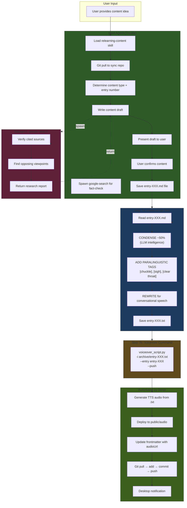

# Relearning-Content Skill Architecture

> **Version:** 4.0 (Qwen3-TTS + Master-to-LinkedIn Video Pipeline)  
> **Last Updated:** Standardized Qwen3-TTS scene audio, master render delivery, and flicker-safe Remotion guidance

## 2026-03 Standard

Treat this section as the current source of truth for relearn.ing journal production.

1. Draft the journal entry in `relearn.ing`
2. Create the condensed narration script with `create-script`
3. Define video scenes directly in `/home/kedbin/Downloads/Organized/Projects/qwen3-tts/generate_manifest_qwen.py`
4. Generate per-scene video audio with Qwen3-TTS into `~/projects/relearn-videos/public/voiceover/`
5. Render a high-quality Remotion master from `~/projects/relearn-videos`
6. Transcode a LinkedIn delivery MP4 from the master with `ffmpeg`
7. Upload only the LinkedIn delivery MP4 and write the returned URN into frontmatter
8. Generate separate journal audio with `voiceover_v2.py`, upload to R2, and set `audioUrl`

### Operational Learnings

- **Do not use Chatterbox for video scene audio.** Video scene audio is Qwen3-TTS only.
- **Do not upload the master render to LinkedIn.** Always render `master -> linkedin.mp4 -> upload`.
- **Redirect long-running renders to log files** instead of streaming progress into chat.
- **Avoid animating SVG `<g>` wrappers around `foreignObject` cards** in Remotion. Fade HTML wrappers or cards directly to reduce blinking/flicker.
- **Keep video audio and journal audio separate.** Video uses per-scene WAV generation; journal uses a full-script MP3.

## Overview

The `relearning-content` skill creates journal entries and project pages for the relearn.ing platform. It now uses a **split journal/video pipeline**:

1. **`create-script` skill** — LLM-powered condensation for narration
2. **Qwen3-TTS video scene generation** — per-scene WAV files + `manifest.json`
3. **Remotion render + LinkedIn transcode** — master first, delivery second
4. **`voiceover` skill** — full journal MP3 generation + deployment

### Why Two Steps?

| What | `--transform` flag | `create-script` skill |
|------|-------------------|----------------------|
| **Method** | Regex/rules-based | LLM intelligence |
| **Condensation** | ❌ None | ✅ ~50% reduction |
| **Paralinguistic tags** | ❌ None | ✅ `[chuckle]`, `[sigh]`, etc. |
| **Conversational rewrite** | ❌ Basic cleanup | ✅ Full rewrite for speech |
| **Result** | 10-min article → 10-min audio | 10-min article → 5-min audio |

---

## Full Workflow Diagram


```mermaid
flowchart TB
    subgraph UserInput["User Input"]
        U1[User provides content idea]
    end

    subgraph MainAgent["Main Agent (Claude)"]
        direction TB
        M1[Load relearning-content skill]
        M2[Git pull to sync repo]
        M3[Determine content type + entry number]
        M4[Write content draft]
        M5[Spawn google-search for fact-check]
        M6[Present draft to user]
        M7[User confirms content]
        M8[Save entry-XXX.md file]
    end

    subgraph FactCheck["Subagent: google-search"]
        G1[Verify cited sources]
        G2[Find opposing viewpoints]
        G3[Return research report]
    end

    subgraph CreateScript["Step 7a: create-script Skill"]
        C1["Read entry-XXX.md"]
        C2["CONDENSE ~50%
        (LLM intelligence)"]
        C3["ADD PARALINGUISTIC TAGS
        [chuckle], [sigh], [clear throat]"]
        C4["REWRITE for conversational speech"]
        C5["Save entry-XXX.txt"]
    end

    subgraph VoiceoverCommand["Step 7b: Voiceover Command"]
        V1["voiceover_script.py
        -i archive/entry-XXX.txt
        --entry entry-XXX
        --push"]
    end

    subgraph AutomatedPipeline["Automated by Script"]
        A1[Generate TTS audio from .txt]
        A2[Deploy to public/audio]
        A3[Update frontmatter with audioUrl]
        A4[Git pull → add → commit → push]
        A5[Desktop notification]
    end

    U1 --> M1 --> M2 --> M3 --> M4
    M4 -.->|spawn| FactCheck
    FactCheck --> G1 --> G2 --> G3
    G3 -.->|return| M4
    M4 --> M6 --> M7 --> M8
    M8 --> CreateScript
    CreateScript --> C1 --> C2 --> C3 --> C4 --> C5
    C5 --> VoiceoverCommand
    VoiceoverCommand --> A1 --> A2 --> A3 --> A4 --> A5

    style MainAgent fill:#2d5a27,stroke:#333
    style FactCheck fill:#5f1e3a,stroke:#333
    style CreateScript fill:#1e3a5f,stroke:#333
    style VoiceoverCommand fill:#5f4a1e,stroke:#333
    style AutomatedPipeline fill:#3a5f1e,stroke:#333
```

---

## The Audio Pipeline Detail

```
[Journal Entry: entry-XXX.md]
        │
        │  ~2,000 words (~13 min read)
        │
        ▼
┌─────────────────────────────────────┐
│     create-script skill (LLM)       │
│                                     │
│  1. CONDENSE ~50%                   │
│     - Remove redundant examples     │
│     - Cut verbose academic prose    │
│     - Preserve key insights         │
│                                     │
│  2. ADD PARALINGUISTIC TAGS         │
│     - [chuckle] at irony            │
│     - [sigh] at frustration         │
│     - [clear throat] at transitions │
│                                     │
│  3. REWRITE for speech              │
│     - Shorter sentences             │
│     - Contractions                  │
│     - Direct address ("you", "we")  │
└─────────────────────────────────────┘
        │
        │  ~1,000 words (~6.5 min listen)
        │
        ▼
[Voiceover Script: entry-XXX.txt]
        │
        ▼
┌─────────────────────────────────────┐
│     voiceover_script.py             │
│                                     │
│  • TTS generation (Chatterbox)      │
│  • Voice cloning (clone.wav)        │
│  • LUFS normalization (-19 LUFS)    │
│  • MP3 encoding (192kbps)           │
│  • Deploy to public/audio/          │
│  • Update frontmatter               │
│  • Git push                         │
│  • Desktop notification             │
└─────────────────────────────────────┘
        │
        ▼
[Audio: entry-XXX.mp3]  →  [Published to relearn.ing]
```

---

## Subagent Decision Matrix

| Scenario | Subagent? | Action |
|----------|-----------|--------|
| Need style reference | **NO** | Style guide is in SKILL.md |
| Need to verify claims/citations | **YES** | `google-search` subagent |
| Need to scan >10 files | **YES** | `explore` subagent |
| Ready for audio script | **NO** | Use `create-script` skill in main thread |
| Ready for TTS generation | **NO** | Run voiceover bash command |

**Only ONE subagent type is typically needed:** `google-search` for fact-checking.

---

## Paralinguistic Tags Reference

The `create-script` skill adds these supported Chatterbox TTS tags:

| Tag | When to Use | Example |
|-----|-------------|---------|
| `[chuckle]` | Self-deprecating humor, light irony | "I spent three weeks on that. [chuckle] Classic." |
| `[sigh]` | Frustration, resignation, relief | "[sigh] And that's when I realized I was wrong." |
| `[laugh]` | Genuine amusement, absurdity | "Thirty-five thousand decisions a day! [laugh]" |
| `[gasp]` | Surprise, sudden realization | "[gasp] That's it. That's the answer." |
| `[clear throat]` | Topic transition, emphasis | "[clear throat] Here's the thing." |
| `[sniff]` | Emotional reflection | "Looking back now... [sniff] it was obvious." |
| `[groan]` | Bad news, frustration | "[groan] Another meeting about meetings." |

**❌ NEVER USE:** `[pause]`, `[breath]`, `[emphasis]`, `[slower]` — Chatterbox ignores these.

---

## CLI Command Reference

### Current Video Pipeline

```bash
cd /home/kedbin/Downloads/Organized/Projects/qwen3-tts
source ~/miniconda3/etc/profile.d/conda.sh && conda activate qwen3-tts
mkdir -p logs
python generate_manifest_qwen.py > logs/entry-XXX-video-audio.log 2>&1

cd ~/projects/relearn-videos
mkdir -p logs
npx remotion render src/index.ts entry-XXX out/entry-XXX-master.mov --codec=prores --concurrency=1 > logs/entry-XXX-render.log 2>&1
ffmpeg -y -i out/entry-XXX-master.mov -c:v libx264 -profile:v high -level 4.2 -pix_fmt yuv420p -r 30 -g 60 -keyint_min 60 -sc_threshold 0 -b:v 10M -maxrate 14M -bufsize 20M -movflags +faststart -c:a aac -b:a 192k -ar 48000 out/entry-XXX-linkedin.mp4 > logs/entry-XXX-ffmpeg.log 2>&1

cd ~/threads && source .venv/bin/activate
python linkedin_video_upload.py --upload-only ~/projects/relearn-videos/out/entry-XXX-linkedin.mp4
```

### Current Journal Audio Pipeline

```bash
cd /home/kedbin/Downloads/Organized/Projects/qwen3-tts
source ~/miniconda3/etc/profile.d/conda.sh && conda activate qwen3-tts
python voiceover_v2.py -i archive/entry-XXX.txt -o archive/entry-XXX.mp3

rclone copyto archive/entry-XXX.mp3 r2:relearn-audio/entry-XXX.mp3
```

### Step 7a: create-script Skill

This is executed via the skill system, not a bash command. The LLM:
1. Reads the journal entry
2. Condenses ~50%
3. Rewrites for natural Qwen3-TTS speech
4. Saves to `/home/kedbin/Downloads/Organized/Projects/qwen3-tts/archive/entry-XXX.txt`

### Step 7b: Voiceover Generation

```bash
cd /home/kedbin/Downloads/Organized/Projects/qwen3-tts && \
source ~/miniconda3/etc/profile.d/conda.sh && conda activate qwen3-tts && \
python voiceover_v2.py -i archive/entry-XXX.txt -o archive/entry-XXX.mp3
```

### Flag Reference

| Flag | Purpose |
|------|---------|
| `-i, --input` | Input `.txt` file (from create-script) |
| `-o, --output` | Output MP3 file (auto-generated if omitted) |
| `-p, --profile` | Voice profile (`edrian` default) |
| `-l, --language` | Language (`Auto` default) |
| `--pause-sentence` | Pause after sentences |
| `--pause-comma` | Pause after commas |

### Environment Variables

| Variable | Default | Purpose |
|----------|---------|---------|
| `RELEARNING_PROJECT_DIR` | `/home/kedbin/Downloads/Organized/Projects/relearn.ing` | Override relearn.ing path |
| `QWEN3_TTS_DIR` | `/home/kedbin/Downloads/Organized/Projects/qwen3-tts` | Override Qwen3-TTS path |

---

## File System Layout

```
~/.opencode/skill/
├── relearning-content/SKILL.md    # Main skill (v2.0)
├── create-script/SKILL.md         # LLM condensation + tags (v5.0)
└── voiceover/SKILL.md             # Journal TTS generation (Qwen3-TTS)

~/Projects/relearn.ing/
├── src/content/
│   ├── config.ts                  # Zod schema
│   ├── journal/entry-XXX.md       # Journal entries
│   └── projects/*.md              # Project pages
├── public/audio/*.mp3             # Deployed audio files
└── docs/RELEARNING-CONTENT-ARCHITECTURE.md  # This file

~/Projects/qwen3-tts/
├── generate_manifest_qwen.py      # Video scene audio + manifest source of truth
├── voiceover_v2.py                # Journal narration generator
├── archive/
│   ├── entry-XXX.txt              # Condensed scripts (from create-script)
│   └── entry-XXX.mp3              # Generated journal audio
└── voice_profiles/*.vp            # Voice profiles

~/projects/relearn-videos/
├── src/compositions/*.tsx         # Remotion compositions
├── src/data/manifest.json         # Scene durations + captions
├── public/voiceover/*.wav         # Video scene audio
└── out/entry-XXX-linkedin.mp4     # Delivery file for LinkedIn upload
```

---

## Example Transformation

### Input (Journal Entry Excerpt - 180 words):

```markdown
## The Physics of Decision Fatigue

Research conducted by Baumeister et al. (1998) demonstrated through a series 
of elegant experiments that our capacity for self-control operates much like 
a muscle—subject to fatigue through repeated exertion. This phenomenon, which 
they termed "ego depletion," has been subsequently validated by over 100 studies.

The implications are significant. When we force ourselves to make decisions 
repeatedly throughout the day, we deplete this finite resource. By evening, 
the average person has made an estimated 35,000 decisions.

* Morning decisions: typically higher quality
* Afternoon decisions: moderate quality  
* Evening decisions: prone to shortcuts and impulse

The solution isn't to "try harder"—that approach ignores the biological reality.
```

### Output (Condensed Script - 95 words, 47% reduction):

```
Baumeister's research showed that willpower works like a muscle. Use it too much, and it gets tired.

[clear throat] Here's the thing. By evening, the average person has made thirty-five thousand decisions. Thirty-five thousand. Your cognitive muscle is exhausted.

[sigh] And the solution isn't to "try harder." That ignores biology.

Instead, we need to architect our environments. Eliminate the low-value decisions. Save your mental reserves for what actually matters.

[chuckle] Stop debugging yourself. Debug your environment.
```

**Report:**
- Original: 180 words → Condensed: 95 words (47% reduction)
- Estimated duration: ~38 seconds
- Tags added: `[clear throat]`, `[sigh]`, `[chuckle]`

---

## Pre-flight Check Output

```
==================================================
PRE-FLIGHT CHECK
==================================================
✓ [OK] Git status: Working directory clean
✓ [OK] ffmpeg: ffmpeg version 6.1.1-3ubuntu5
✓ [OK] CUDA: Available: AMD Radeon RX 9070 XT
✓ [OK] Disk space: 31.0 GB free
✓ [OK] Network: GitHub reachable
✓ [OK] Voice file: clone.wav found (884.8 KB)
ℹ [INFO] Next entry: entry-013.md
==================================================
All critical checks passed. Ready to generate voiceover.
```

---

## Token Budget

| Operation | Tokens | Notes |
|-----------|--------|-------|
| Load relearning-content skill | ~15,000 | Includes style guide |
| Fact-check (google-search subagent) | ~10,000 | Isolated context |
| create-script (main thread) | ~5,000 | LLM transformation |
| voiceover (bash command) | ~500 | Just command execution |
| **Total main context** | ~20,500 | Efficient use of context |

---

## Quick Start

1. **Write content** in main thread following the style guide
2. **Fact-check** with `google-search` subagent (only subagent needed)
3. **Save** the entry-XXX.md file
4. **Create script** using `create-script` skill (condenses + adds tags)
5. **Generate voiceover**:
   ```bash
   cd /home/kedbin/Downloads/Organized/Projects/chatterbox && \
   nohup uv run python archive/voiceover_script.py \
     -i archive/entry-XXX.txt \
     -o archive/entry-XXX.mp3 \
     --entry entry-XXX \
     --push > voiceover.log 2>&1 &
   ```
6. **Done!** Script handles TTS → deploy → git push → notification.

---

*Architecture documentation v3.0 - Two-step audio pipeline with LLM-powered condensation*
